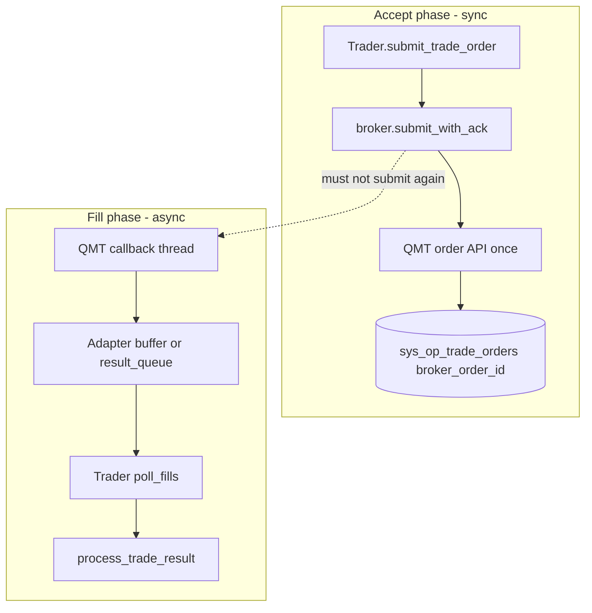
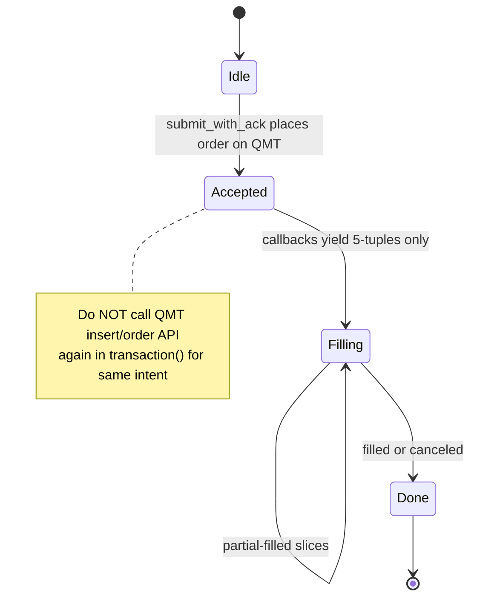

# XtQuant / MiniQMT Broker Adapter Contract (v1)

> **Audience**: Contributors implementing `qteasy-xtquant` or reviewing MiniQMT integration against qteasy **2.5.1+**.  
> **Language**: English (normative for collaboration).  
> **Related**: :doc:`4-broker-adapter-and-integration`, `qteasy.trade_io`, `qteasy.broker`.

This document is the **v1 contract** for wiring **XtQuant / MiniQMT** into qteasy’s live-trading stack. It does **not** replace the general Broker adapter guide; it adds QMT-specific rules on top of it.

---

## 0. Scope and non-goals

**In scope (v1)**

- `live_trade_broker_type='xtquant'` (configuration whitelist; factory registration via extension package)
- Real **broker order IDs** from QMT at accept time and in fill reports
- `submit_with_ack` + `poll_fills` as the **primary** Trader path
- `transaction()` as an internal generator yielding **4- or 5-tuples** (QMT adapters must yield **5-tuples** with real IDs)

**Out of scope (v1)**

- Merging fork `trader.py` blocks (pre-check locks, DIAG spam, manual `result_queue` drain, MySQL-only data policy)
- Hard `import brokers` or `from qteasy_xtquant` inside `qteasy/broker.py`
- Price channel `live_price_acquire_channel='xtquant'` (see separate PR for `xtfuncs` / `data_channels`)

---

## 1. Configuration and registration

### 1.1 Configuration

`build_live_trade_config(..., live_trade_broker_type='xtquant')` and `qt.configure(live_trade_broker_type='xtquant')` are **allowed** as of qteasy 2.5.1 (PR-0b).

This only validates the **string**; it does **not** install XtQuant or register the broker class.

### 1.2 Extension package registration (required for real QMT)

```python
import qteasy_xtquant

qteasy_xtquant.register()  # calls register_broker_factory('xtquant', XtQuantBroker)
```

**Do not** patch `qteasy.broker.get_broker()` to `from brokers import ...`.

Until `register()` runs, `get_broker('xtquant')` may fall back to `SimulatorBroker` (misleading for production). Live runs must call `register()` before `Operator.run(..., mode=0)`.

---

## 2. Data contracts (`qteasy.trade_io`)

All orders and raw fills must pass:

- `validate_trade_order()` — shape of orders entering the Broker layer  
- `validate_raw_trade_result()` — shape of fills leaving the Broker layer  

TypedDict references (informative; **validators are authoritative**):

| Name | Module | Purpose |
|------|--------|---------|
| `TradeOrderDict` | `qteasy.trade_io` | Order dict before / during Broker handling |
| `RawTradeResultDict` | `qteasy.trade_io` | One fill/cancel slice before `process_trade_result` |

### 2.1 `TradeOrderDict` (required keys)

| Key | Type | Notes |
|-----|------|-------|
| `order_id` | int | Local DB order id |
| `pos_id` | int | Position id |
| `direction` | str | `'buy'` / `'sell'` |
| `order_type` | str | `'market'` / `'limit'` |
| `qty` | float | > 0 |
| `price` | float | > 0 |
| `status` | str | Must be `'submitted'` when passed to Broker |
| `submitted_time` | str or None | ISO-like timestamp string |

Optional: `symbol`, `position` (validated if present).

### 2.2 `RawTradeResultDict` (required keys)

| Key | Type | Notes |
|-----|------|-------|
| `order_id` | int | Matches local order |
| `filled_qty` | float | ≥ 0 |
| `price` | float | ≥ 0; 0 when canceled-only slice |
| `transaction_fee` | float | ≥ 0 |
| `execution_time` | str | Parseable datetime string |
| `canceled_qty` | float | ≥ 0 |
| `delivery_amount` | float | Often 0 at Broker layer |
| `delivery_status` | str | e.g. `'ND'` |

Optional (recommended for QMT):

| Key | Type | Notes |
|-----|------|-------|
| `broker_order_id` | str | **Real QMT order id** when known |
| `status` | str | `'filled'` / `'partial-filled'` / `'canceled'` |
| `raw_status` | str | Broker-native status text/code |

---

## 3. `submit_with_ack` — accept phase

`XtQuantBroker` **must override** the base implementation that only enqueues and returns a **synthetic** id (`SimulatorBroker:order_id:seq`).

### 3.1 Call flow

```text
Trader.submit_trade_order()
  → record_trade_order (local row, status created)
  → broker.connect()
  → broker.submit_with_ack(order)
  → if accepted: update_trade_order(status='submitted', broker_order_id=..., broker_name=...)
  → if rejected: update_trade_order(status='rejected'), broker_order_id empty
```

### 3.2 Return dict (normative)

| Field | Type | When `accepted=True` | When `accepted=False` |
|-------|------|----------------------|------------------------|
| `accepted` | bool | `True` | `False` |
| `order_id` | int or None | Local `order_id` if parseable | Same |
| `broker_order_id` | str | **Real QMT order id** (non-empty) | `''` |
| `reason` | str | `''` | English explanation |
| `reason_code` | str | `''` | e.g. exception class name or broker code |

**DB rule**: On success, Trader persists `broker_order_id` to `sys_op_trade_orders` **before** async fills are processed. Reconciliation and cancel must use this id.

### 3.3 QMT-specific accept rules

- Perform **one** QMT submit per local `order_id` intent in `submit_with_ack`.
- Do **not** submit again in `transaction()` for the same intent (see §5).
- On QMT reject, return `accepted=False` with clear `reason` / `reason_code`; do not leave the local row `submitted`.

---

## 4. Fill delivery: `poll_fills`, `result_queue`, and `broker.run`

qteasy 2.5.1 uses **two** fill paths. XtQuant adapters must support the **Trader main loop** path.

### 4.1 Primary path (Trader live loop)

```text
Trader main loop (trading day)
  → broker.poll_fills(timeout=0)
  → for each raw dict: validate_raw_trade_result
  → add_task('process_result', raw)
  → process_trade_result → ledger / order status updates
```

Implement `poll_fills` to return fills produced by QMT callbacks (deque / internal buffer), each dict satisfying `RawTradeResultDict`.

### 4.2 Legacy path (`broker.run` thread)

```text
broker.run() loop
  → order_queue.get()
  → _get_result(order)
       → for slice in transaction(...): build raw_trade_result → result_queue.put()
```

`poll_fills` **also** drains `result_queue` when connected (compat). For QMT:

- Callback thread should push normalized fills into the structure `poll_fills` reads (preferred), **or**
- Bridge callback → `result_queue` without blocking Trader.

### 4.3 Relationship diagram



**Invariant**: Accept phase owns **placement**; fill phase owns **execution reports**. Same local `order_id` + same QMT `broker_order_id` tie the two phases together.

---

## 5. `transaction()` — 4/5-tuple generator

Base class `Broker.transaction()` may yield:

- **4-tuple**: `(result_type, qty, price, fee)` — built-in simulators  
- **5-tuple**: `(result_type, qty, price, fee, broker_order_id)` — **required for XtQuant**

| Component | Meaning |
|-----------|---------|
| `result_type` | `'filled'`, `'partial-filled'`, or `'canceled'` |
| `qty` | **This slice** quantity; must be `0 < qty <= order_qty` (order total) |
| `price` | Fill price; `0` if `result_type=='canceled'` |
| `fee` | Fee for this slice; ≥ 0 |
| `broker_order_id` | str or None; if str, copied to `raw_trade_result['broker_order_id']` |

`_get_result` validates each yield against the **order total** `order_qty` (not the previous slice qty). Partial fills must not reuse the loop variable name `qty` for order size (fixed in qteasy PR-0a).

### 5.1 Forbidden: double submit to QMT



| Pattern | Verdict |
|---------|---------|
| `submit_with_ack` → QMT order API; `transaction()` only maps callbacks → 5-tuple | **Correct** |
| `submit_with_ack` only enqueues; `transaction()` calls QMT order API | **Wrong** (double submit risk) |
| Both `submit_with_ack` and `transaction()` call QMT order API | **Forbidden** |

---

## 6. `submit()` vs `submit_with_ack` (extension testing)

`Broker.submit()` runs `transaction()` **synchronously** and appends to `_pending_fills`. Useful for unit tests; **Trader production path uses `submit_with_ack` + `poll_fills`.**

If `submit()` is used in tests with 5-tuples, `broker_order_id` in each fill should still be the **real** QMT id when simulating production.

---

## 7. Differences from helloeveroneday fork (ext-dev)

| Topic | Fork tendency | qteasy 2.5.1 + this contract |
|-------|---------------|------------------------------|
| Trader changes | Large pre-check / DIAG / queue drain | **No** merge; use `RiskManager` + Broker adapter |
| Tuple contract | 5-tuple only | 4-tuple allowed for simulators; **XtQuant uses 5-tuple** |
| Broker registration | `from brokers import ...` in `get_broker` | `register_broker_factory('xtquant', ...)` only |
| Accept API | Often queue-only | **`submit_with_ack` with real boid** |
| Data layer | MySQL-only assumptions | Not required for upstream PR |

Problem definitions from fork production incidents (ghost orders, rebalance race) remain valuable; implementations belong in **Broker / extension package / docs**, not fork-style `trader.py` patches.

---

## 8. Minimal acceptance (Spike / S0)

- [ ] `submit_with_ack` returns `accepted=True` and **non-synthetic** `broker_order_id` on Windows + miniQMT  
- [ ] DB row `sys_op_trade_orders.broker_order_id` matches QMT UI order id  
- [ ] `poll_fills` → `process_result` processes at least one fill  
- [ ] No duplicate QMT order for one local `order_id`  
- [ ] Mac/Linux CI: mock `xtquant` module tests without real QMT  

---

## 9. References

- General adapter guide: :doc:`4-broker-adapter-and-integration`  
- Order lifecycle: :doc:`3-risk-and-order-lifecycle`  
- Code: `qteasy/broker.py`, `qteasy/trader.py`, `qteasy/trade_io.py`  
- Upstream tests: `tests/test_broker_order_id_persistence_20260429.py`, `tests/test_trade_io_contracts.py`

**Contract version**: v1 (2026-05; qteasy 2.5.1, PR-0a/0b). Changes should be discussed via GitHub issue before implementation drift.
